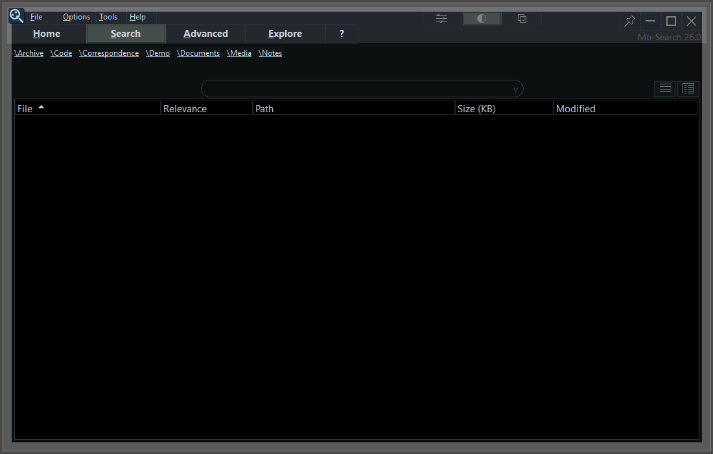
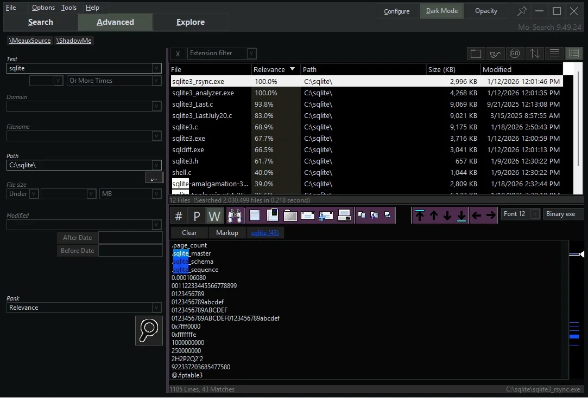
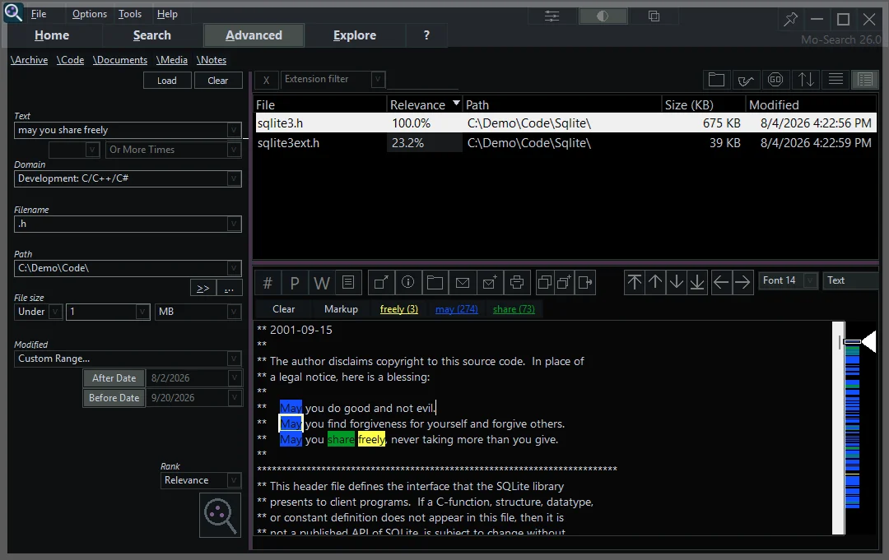
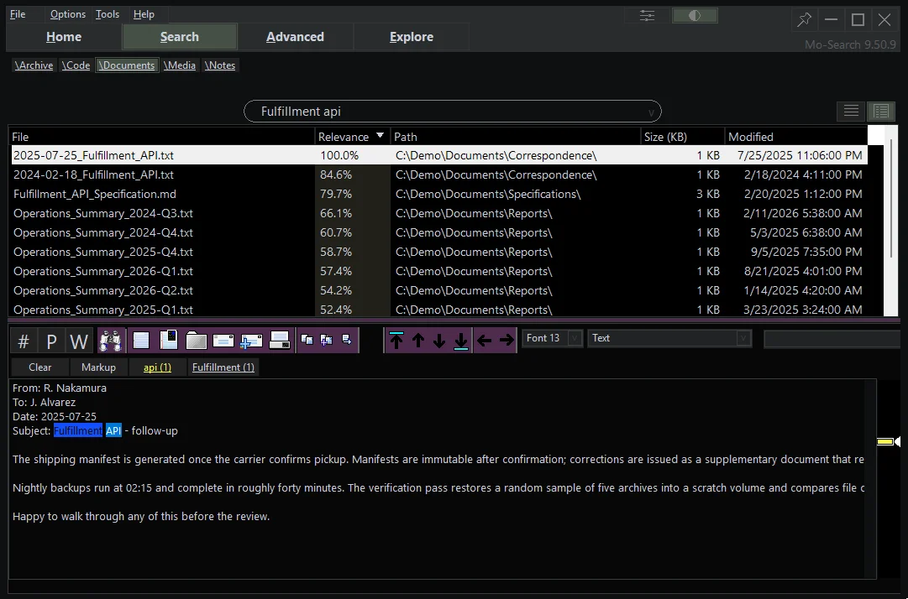
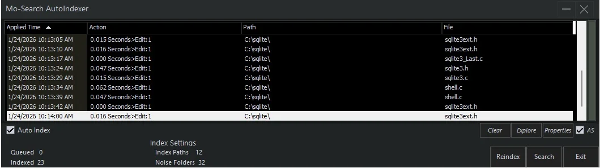

# Mo-Search

> Documentation baseline: Mo-Search 9.50.8, the current public release.

**Full-text desktop search for Windows — your whole machine, indexed locally,
ranked in milliseconds.**

Mo-Search maintains a local index of the files and locations you choose and
returns ranked results without uploading indexed content to a cloud service.
It has been in continuous development since 2005.

<picture>
  <source media="(prefers-color-scheme: dark)" srcset="media/simple-search-dark.gif">
  <source media="(prefers-color-scheme: light)" srcset="media/simple-search-light.gif">
  
</picture>

<picture>
  <source media="(prefers-color-scheme: dark)" srcset="media/ranked-results.webp">
  <source media="(prefers-color-scheme: light)" srcset="media/ranked-results-light.webp">
  
</picture>

## What it does

- Searches file names, paths, and indexed text across selected locations.
- Ranks matching files by relevance and shows match counts per file.
- Provides advanced filters for paths, filenames, dates, sizes, extensions,
  and content domains.
- Includes an integrated viewer that jumps between hits, so you can judge a
  match without opening every file in another application.
- Maintains its index in the background, so repeated searches stay fast.
- Adds practical file tools around search: duplicate finding, folder sizing,
  favorites, and search history.

<picture>
  <source media="(prefers-color-scheme: dark)" srcset="media/advanced-filters.webp">
  <source media="(prefers-color-scheme: light)" srcset="media/advanced-filters-light.webp">
  
</picture>

<picture>
  <source media="(prefers-color-scheme: dark)" srcset="media/integrated-viewer.webp">
  <source media="(prefers-color-scheme: light)" srcset="media/integrated-viewer-light.webp">
  
</picture>

<picture>
  <source media="(prefers-color-scheme: dark)" srcset="media/indexer-status.webp">
  <source media="(prefers-color-scheme: light)" srcset="media/indexer-status-light.webp">
  
</picture>

## How it compares

Most people arrive at Mo-Search from one of two directions:

- **From filename search** (such as Everything): instant name matching is
  excellent, but it cannot tell you which of those files actually contains the
  phrase you remember. Mo-Search indexes the *text*, ranks the results, and
  shows you the matching lines.
- **From Windows Search**: Mo-Search lets you decide exactly which drives,
  folders, and file types are indexed, ranks results by relevance rather than
  recency, and keeps the index and the viewer in one window built for
  searching rather than browsing.

Mo-Search is proprietary, closed-source Windows software rather than an
open-source tool; see the [Meauxsoft website](https://www.meauxsoft.com) for
the current availability and licensing terms, and [License](LICENSE.md) for
what this repository does and does not grant.

## MoContext is included

The Mo-Search installer also includes
[MoContext](https://github.com/Meauxsoft/mocontext), a local MCP server that
lets compatible AI clients — Codex, Claude Code, Cursor, Windsurf, VS Code —
search and read grounded context from the existing Mo-Search index. Your agent
can answer "where did I handle this before?" across everything you index, not
just the folder it has open.

MoContext and Mo-Search currently ship together in one installer and release
cycle. MoContext has separate GitHub documentation because MCP users search for
that capability directly; it is not a separate installer.

MoContext is currently included at no additional charge and is planned to
become a paid add-on as its capabilities grow. Check the product site and
license shown by the current installer for the applicable terms.

## Download and requirements

Mo-Search supports Windows 10 and 11. Download the current installer from the
[official Meauxsoft website](https://www.meauxsoft.com).

This repository is a public product and documentation front door. It does not
contain the proprietary Mo-Search source code.

## Privacy

The Mo-Search index is stored locally and indexed content is not uploaded to a
Meauxsoft cloud service. If you use MoContext with a cloud-backed AI client,
the client may transmit the context it retrieves to its model provider; review
that provider's privacy and retention terms. See [PRIVACY.md](PRIVACY.md).

## Documentation and support

- [Changelog](CHANGELOG.md) — released versions, back to 2005
- [Privacy](PRIVACY.md)
- [Support and issue reporting](SUPPORT.md)
- [Security policy](SECURITY.md)
- [License](LICENSE.md)
- [meauxsoft.com](https://www.meauxsoft.com) — product page, downloads, and
  full documentation

For public bug reports and feature requests, use the
[Mo-Search issue tracker](https://github.com/Meauxsoft/mo-search/issues).
MoContext-specific reports belong in the
[MoContext issue tracker](https://github.com/Meauxsoft/mocontext/issues).
Private, licensing, and security matters go to
[Questions@meauxsoft.com](mailto:Questions@meauxsoft.com).
